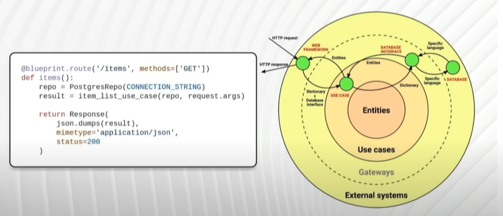

### Clean Architecture (durability, utility and beauty)
main idea idea behind the the clean architecture is to seperate the layers of a system:
- the external systems (database, http framework...)
- use cases: the use cases where the business logic will be implemented
- the gateways (also known as interfaces): bridges between the use cases and the external systems
- entities: structure that represente the business 
Clean architecture organise the data flow between those layers, simple data structure inwards, interfaces outwards
- an external system (http framework) send simple structure data (ex: a dictionnarie) to the use case,
the use case return an instance of an Entity

### Messages flow in a clean architecture
- each ring can see/use only what is inside, that is why in the example below, the http framework (an external system) can initiate an instance of PostgresRepo (a gateway), but the item_list_use_case(a use case) can not initiate it for it self, this way we can change the used gateway (PostgresRepo) without touching the use case/logic (item_list_use_case)
- i think that the clean architecture is more suitable for bigger systems, a small microservice may not need to implement to full complete clean architecture

